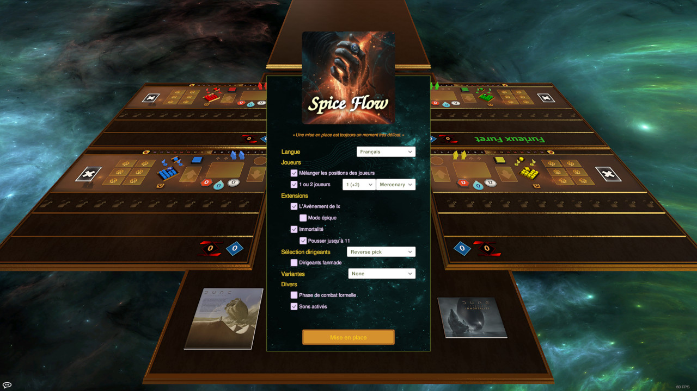

# Spice Flow Mod for Tabletop Simulator

A complete rewrite of Dune Immorality from scratch to overcome the limitations of the code base and introduces more elaborated features : assisted revelation, automated Hagal House, Arrakeen Scouts, etc.

*Note: formely known as "Dune Immorality - Alpha Test".*

Features:

- Base game 3-4P
- Rise of Ix extension
- Immortality extension
- Hagal House
- Arrakeen Scouts

Supported langages:

- French
- English

## Links :

- Steam: https://steamcommunity.com/sharedfiles/filedetails/?id=3043517751

## Build Process

cf. [tts_build/README.md](tts_build/README.md)

## Disclaimer

This repository contains the JSON skeletons and Lua scripts of various mods for Dune Imperium/Uprising (referenced resources are not included). With the exception of the "immorality" branch, all other branches contain code exclusively written by [me](https://steamcommunity.com/profiles/76561197978597744/myworkshopfiles/?appid=286160) under the "Unlicense" license. That means you can do whatever you want with it, you have my blessing. Things are obviously not so simple regarding the referenced resources which are no more than a collection of illegal images and 3D models. If my contributions are freely usable (e.g. 3D boards), I cannot speak on behalf of any other contributors.

## TODO

- Scan Arrakeen Scouts deck (en).
- Arrakeen Scouts history (as cards).
- Rival expert deployment / brutal escalation / churn.
- Main board in French.
- Fix Research Station bound to Ix extension.
