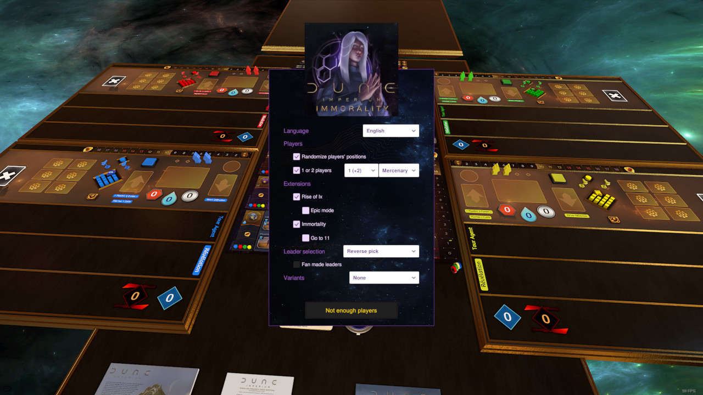

# Dune Immorality TTS Mod

Features:
- Base game
- Rise of Ix extension
- Immortality extension
- Hagal House
- (Blitz!)
- Arrakeen Scouts
- (Fanmade leaders)
- (Reload support)

Supported langages:
- French
- English

## Links :

- Steam: https://steamcommunity.com/sharedfiles/filedetails/?id=3043517751
- Mod: 3043517751

## FIXME

- Investigate missing trigger effects on guests after a reload.
- Fix the whole save/reload behavior in a minimal way.
- Missing Rise of Ix board without Immortality.
- 6 tech park saturation.
- Revoir Rival -> Action / POO.
- Nouvelles cartes Hagal améliorées (en/fr).
- Reports Uprising.

## TODO (by priority)

- Blitz!
- Rival combat optimization.
- Régis Étienne's [fanmade leaders compilation](https://forum.cwowd.com/t/dune-imperium-personnages-fanmade/45175).
- Arkhane's [Fanmade leaders compilation](https://boardgamegeek.com/thread/3144891/73-more-powerful-leaders-balanced-each-others-epic) (to be updated).
- Replace freighters by tokens.
- Change the [dreadnought model](https://www.thingiverse.com/thing:5326146).
- Handle all space access options and explain agent action failures.

## Later (maybe)

- Introduce the graphic log?
- Keep Module special, but unify everything else?
- Move the Tleilaxu track in its own module?
- Workaround the font_size ratio / support for the boards.
- Gather all VP sources in ScoreBoard?
- Some kind of hungarian notation with Array (ipairs) and Dict (pairs), a Array being a Dict?
- Alt mouse hover defeated by area buttons...
- Redundancy GMNotes VS resolve using them?
- Better support for chained transferts in Parks.
- Fix Steam languages metadata.
- Mentat washing when crossing its zone.
- Finer playable intrigue detection in solo.
- Accumulation and immediate acquisition by Helena.

## Build Process

cf. [tts_build/README.md](tts_build/README.md)
