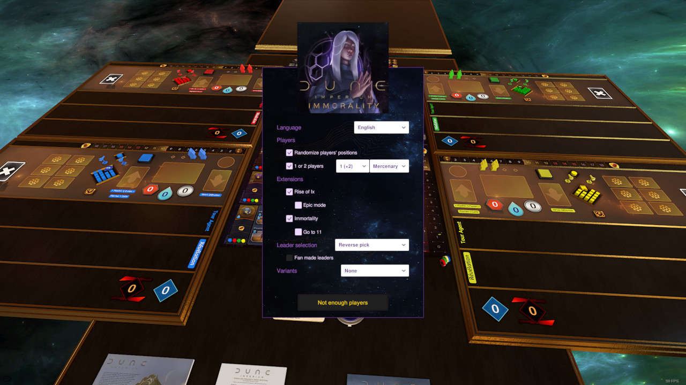

# Dune Immortality TTS mod

ID: 2956104551

## To do

- Consolidate actions (textual log).
- Combat and combat outcome phases.
- The Tleilaxu part.
- Identify and detect played cards.
- Score track.
- Reminder.
- Game over.
- Wrapping Leader -> Action.
- Resource and ability allocation of leaders (including Hagal + difficulty).
- The Hagal house.
- Introduce the graphic log.
- Restore translations.
- Restore music.
- Blitz!
- Arrakeen Scouts.

## Principles

1. Anything -> Action (+ log) -> Anything
2. Anything (-> Leader/Hagal -> Action (+ log)) -> Anything

## Thoughts

On the script side:
- A single Global script both to simplify and for performance reasons (especially during assembly).
- Introduction of a 'lazyRequire' allowing cyclic dependencies.
- Hunt for Wait.time/frames and management of those which remain.
- Centralization of actions in a single module serving as a facade (with log), accessed directly or via a Leader/Hagal to modulate the actions of a player (and group together in one place the leader capabilities, including fanmade).
- Reimplementation of the turn system to overcome the limitations of the TTS built-in system.
- More procedurally generated content.
- Transformation of tech tiles and leaders into cards.

UI side:
- The graphic elements of the trays play the role of buttons (which are no longer directly visible). e.g. click on the influence track to modify its influence or on a space to send an agent there. It's more aesthetic and also more ergonomic it seems to me (especially because the click surfaces are larger).
- A single turn pass button.
- A more systematic (but adaptive) division of the game phases (explicit turns for the fight, for the rewards, for the endgame, etc.)

It should be noted in passing that the positioning on the elements of the game is essentially done using (numerous) zones (and procedural creation of transitory anchoring objects). Where possible, transitional areas are also created procedurally based on the position of objects. An alternative approach that can be seen in the xxx mod is to create separate objects for locations. It has the advantage of being easily manipulated under TTS, but it is more restrictive to create. When it comes to repositioning bulk content, I'm using a Python script here that directly manipulates the save file.
