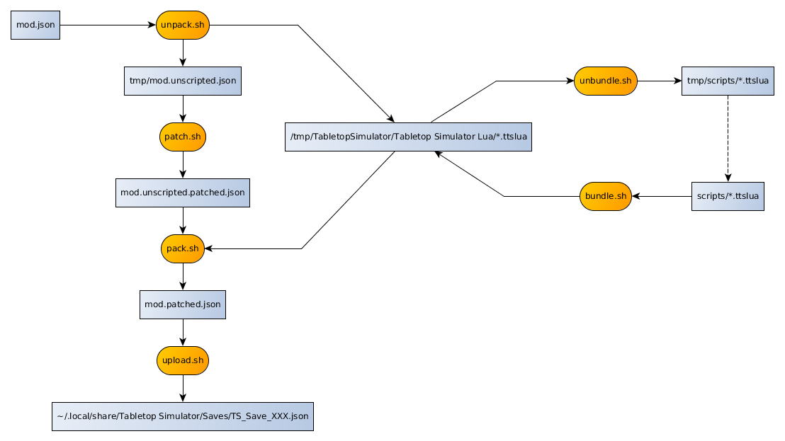

# Dune Immorality TTS Mod

ID: 2956104551

## Build Process

The whole process could be executed with a single call:

    ./build

It amounts to call the sequence of commands `import + unpack + unbundle + patch + bundle + pack + export`.
However, when only modifying scripts, the beginning of this sequence is not needed and,
after an initial call to `import + unpack + unbundle`, we simply need to call `bundle + pack + export`.

The two Python scripts `upload.py` and `listen.py` are a new addition to take advantage of the TTS Editor API.
The second is especially useful to translate the error message locations into ctrl-clickable links.
When using this path, the `bundle + pack + export` sequence above becomes `bundle + upload`:

    ./bundle.sh && ./upload.py

Having launched `./listen.py` in another terminal will provide you with an immediate feedback from TTS.

## Principles

- Game -> Action (+log)
- Player (-> Leader/Hagal -> Action (+log))

## Sequencing (partial)

    Global.setUp
            LeaderSelection.setUp
                [LeaderSelection.setUpTest
                    Playboard.setLeader(color, leader)]
                [LeaderSelection.setUpPicking]

    TurnControl.start
        TurnControl.startPhase(leaderSelection)
            [Hagal.pickAnyCompatibleLeader(color)
                LeaderSelection.claimLeader(color, leaderOrPseudoLeader)
                    Playboard.setLeader(color, leader)]
            [<click>
                LeaderSelection.claimLeader(color, leader)
                    Playboard.setLeader(color, leader)]
            Playboard.setLeader(color, leader)
                playboard.leader =
                    Hagal.newRival(Leader.getLeader(leaderCard) | nil) |
                    Leader.getLeader(leaderCard)

    TurnControl.endOfTurn
        TurnControl.next
            TurnControl.findActivePlayer
                TurnControl >-(playerTurns, color)->
                    Playboard.setActivePlayer(phase, color)
                        [Hagal.activate(phase, color, playboard)
                                Hagal.lateActivate(phase, color, playboard) -- En tandem avec leader as Rival.]
                TurnControl.startPhase(TurnControl.getNextPhase)

    TurnControl.endOfTurn
        TurnControl.next
            TurnControl.findActivePlayer
                TurnControl.startPhase(nextPhase)

## TODO (by priority)

- Identify and detect played cards.
- Advanced reveal.
- Family atomics.
- Endgame.
- The Hagal house (with resources and difficulty levels).

- Migrer les description dans GMNotes.
- Restore translations.

- Restore selectable combat music.

- Blitz!
- Arrakeen Scouts.

- Fanmade leaders.

- Introduce the graphic log?
- Keep Module special, but unify everything else?
- Decouple the tech effects / benefits?
- Move the Tleilaxu track in its own module?
- Where to put VP and how trash them?
- Explain font_size ratio / support.
- Check for anchor and callback leaks.
