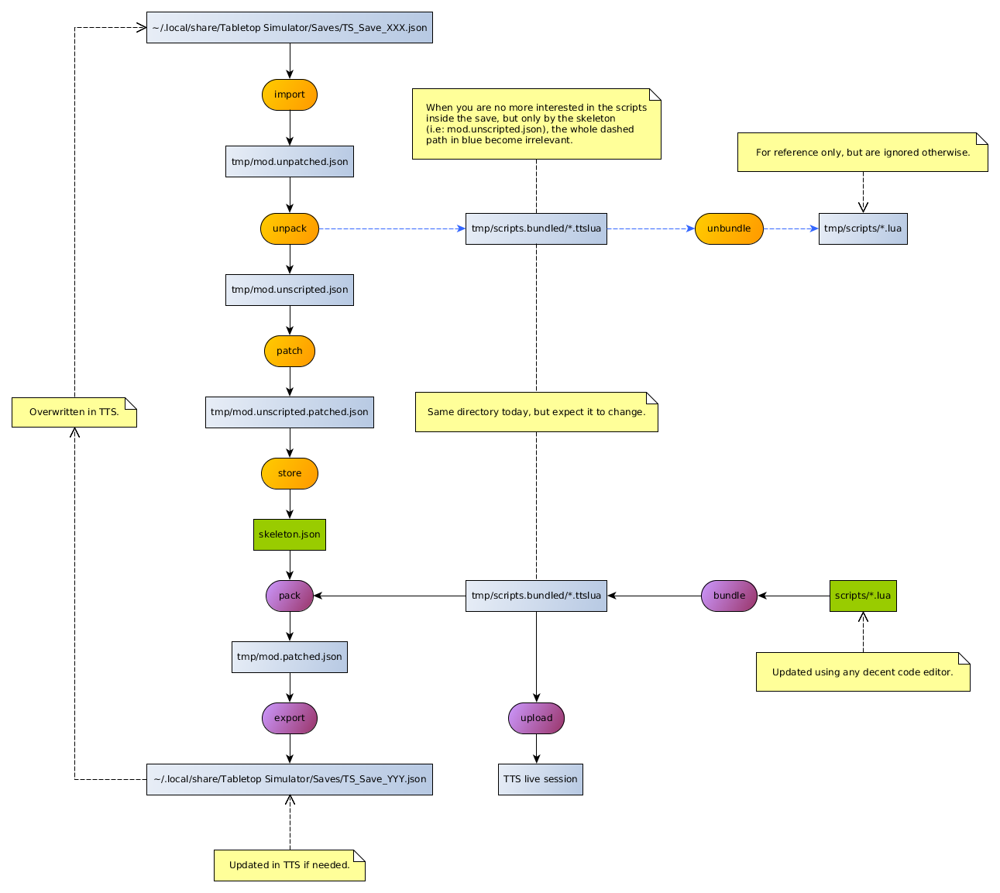

# Build Process

## Requirements

- [LuaBundler](https://github.com/Benjamin-Dobell/luabundler)
- Python 3

## Build & Deploy

**First time:**

```bash
python3 build.py
```

You should now have a new save 201 in TTS.

**You've only changed the scripts, but don't have a running TTS instance with a loaded save:**

```bash
python3 build.py
```

**You've only change the scripts and have a running TTS instance with a loaded save:**

```bash
python3 build.py --upload
```

It directly updates the scripts to your live save.

**You've changed the save in TSS:**

Overwrite the save 200 with it, then `python3 build.py --full` and finally reload the save 201.

**You want to change the save outside TSS:**

Edit the local `skeleton.json` file, then `python3 build.py` and reload the save.

## Notes

Using 'TS_Save_200.json' and 'TS_Save_201.json' as our working saves is arbitrary and could be changed in the top `build.py` file.
In fact, the two could be the same, it's just safer to separate the two of them.

## Internals



The whole process could be executed with a single call:

```bash
python3 build.py --full
```

It amounts to call the sequence of commands `import + unpack + unbundle + patch + store + bundle + pack + export`.
However, when only modifying scripts, the beginning of this sequence is not needed and,
after an initial call to `import + unpack + unbundle + patch + store`, we simply need to call `bundle + pack + export`.

```bash
python3 build.py
```

If you have a TTS instance running your target save, you can also use the `upload` path instead of `pack + export`
The two Python scripts `upload.py` and `listen.py` are a new addition to take advantage of the TTS Editor API.
The second is especially useful to translate the error message locations into ctrl-clickable links.
When using this path, the `bundle + pack + export` sequence above becomes `bundle + upload`:

```bash
python3 listen.py
```

Having launched `listen.py` in another terminal will provide you with an immediate feedback from TTS.
